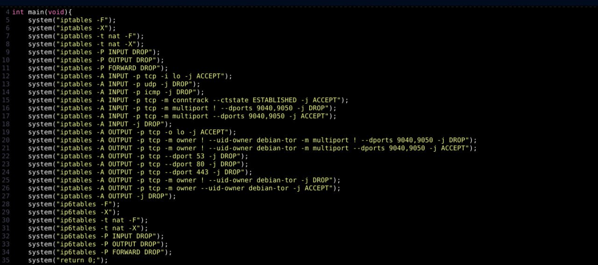

# ICARUS WINGS

    "Learn to fly, but remember that the higher you fly, the harder the fall that awaits you."

</a>

    

 # Module1 - Creating and configuring our server.
   
### What do you need to know before we get started?
In this project we will use the .onion network to host our forum.

To begin with, it's essential to establish a solid foundation, which can be built on in a variety of ways, depending on the preferences of the individual who wants to host the forum.

There are two very effective ways when we think of creating a forum. That are:

1  :black_circle: Use an external vps that accepts payment in monero. Choose an operating system of your choice, we will use CentOs

There are several online provider options that accept monero and guarantee good security.

| LINK 1 |   LINK 2 | LINK 3 |
|----------|----------|----------|
|  https://coin.host/vps-hosting/bitcoin  |  https://www.privex.io/ |  https://monovm.com/vps-server/monero/  |

<h4>:warning:The links are from some providers that accept Monero. They are far from universally true. Choose your preferred VPS.:warning:</h4>

### After purchasing the VPS and gaining access to the CentOS server, we will route all traffic through the Tor network.

  <strong>SETTINGS</strong>

| Step |      Command                        | Description                            |
|-------|-------------------------------------|--------------------------------------|
| 1     | sudo yum install tor                | A - Open the terminal on CentOS and run the command below to install Tor. :                      |
| 2     | sudo vi /etc/tor/torrc              | B - After installation, open the Tor configuration file using your preferred text editor. For example.|
| 3     | SocksPort 9050                      | C - Inside the file, look for the line "SocksPort" and make sure it is uncommented and set to the desired port (usually port 9050). If you don't find the line, add it with the following configuration.          |
| 4     | DNSPort 53                          | D -  Then look for the "DNSPort" line and make sure it is uncommented and set to the desired port (usually port 53). If you don't find the line, add it with the following configuration.              |
| 5     | sudo systemctl restart tor          | E - Restart the Tor service to apply the settings you made.          |
| 6     | sudo vi /etc/sysctl.conf            | F - Open the firewall configuration file using your preferred text editor. For example. |
| 7     | net.ipv4.ip_forward = 1             | G - Inside the file, look for the line "net.ipv4.ip_forward" and make sure it is uncommented and set to "1". If you don't find the line, add it with the following configuration.     |
| 8     | sudo sysctl -p                      | H - Restart the firewall service to apply the settings made. |

SCRIPTS FOR PROCESS AUTOMATION: 

* [TorGhost](https://github.com/SusmithKrishnan/torghost)

* [Tor](https://github.com/r0oth3x49/Tor)

  <strong>INSTALLING DOCKER ON OUR VPS AND PROTECTING IT.
</strong>

### Why install Docker on a VPS?

Docker itself contributes to something called "Process Isolation".

Process isolation refers to the practice of running processes in a protected environment that is separate from each other. This isolation is critical to preventing privilege escalation attacks and limiting the impact of security vulnerabilities.

  <strong>INSTALL DOCKER.
</strong>

| Step | Command                             |      Description                       |
|-------|-------------------------------------|--------------------------------------|
| 1     | sudo yum update                |   Update the system packages                     |
| 2     | sudo yum install -y yum-utils device-mapper-persistent-data lvm2            | Install the required dependencies |
| 3     | sudo yum-config-manager --add-repo https://download.docker.com/linux/centos/docker-ce.repo           |   Add the Docker repository to your system   |
| 4     | sudo yum install -y docker-ce docker-ce-cli containerd.io                         |   Install Docker              |
| 5     | sudo systemctl start docker        |    Start the Docker service            |
| 6     | sudo systemctl enable docker           |Enable Docker to start on system boot  |
| 7     | sudo docker run hello-world         |    Verify the Docker installation by running the hello-world container  |

## Easier way

* In this module, we will be using curl: curl -fsSL https://get.docker.com | bash

  <strong>INSTALL UBUNTU IMAGE IN DOCKER
</strong>

| Step |       Command                       |    Description                         |
|-------|-------------------------------------|--------------------------------------|
| 1     | sudo docker pull ubuntu                | Open the terminal or command line and run the following command to download the Ubuntu image:                        |
| 2     | sudo docker images              | After the download is complete, you can verify that the image downloaded correctly by running the following command |
| 3     | sudo docker run -it ubuntu | This will launch an interactive Ubuntu container where you can run commands and work with the operating system inside the container.|

After installing the Ubuntu image in our Docker container, we will apply some anonymity and security measures on the container. For this, we will use a very recent but very useful tool called "Whoami".
If you want to know more, read her documentation:(https://github.com/owerdogan/whoami-project)

We will use the "whoami" tool to destroy log files on our system, ban the attacker in case of Mitm attack, and change the macadress

### Installing whoami

*  sudo apt update && sudo apt install tar tor curl python3 python3-scapy network-manager
*  git clone https://github.com/omer-dogan/kali-whoami
*  sudo make install 
#### After installation, run these commands:
* sudo install -m 755 kali-whoami /usr/bin
* sudo mkdir -p /usr/share/kali-whoami/backups
* sudo cp -vr assets /usr/share/kali-whoami

### Docker Container Security Tips and Recommendations

There is an essential need to secure your Docker containers to ensure the security and integrity of your applications and data. Fortunately, there are several tutorials available on different channels that can help you implement proper security measures. Here are some recommended channels and tutorials to help you on that journey:

* https://www.youtube.com/watch?v=KINjI1tlo2w
* https://www.youtube.com/watch?v=CQLtT_qeB40
* https://www.youtube.com/watch?v=mQkVB6KMHCg

#### Pentesting in your environment is important. There are some tools that will help you with this task.

* https://github.com/liamg/traitor [TRAITOR]
* https://github.com/carlospolop/PEASS-ng/tree/master/linPEAS [LINPEAS]
* https://github.com/docker/docker-bench-security [DOCKER_BENCH_SECURITY]
* https://github.com/Magentron/chkrootkit [CHKROOTKIT]

#### :warning:Encryption best practices on CentOS and Ubuntu system (installed on our Docker system):warning:

To ensure data security on our CentOS and Ubuntu systems, it is important to adopt good encryption practices. Here are some recommendations:

1. Encrypt disk during installation using LUKS: During operating system installation, we can choose to encrypt disk using LUKS (Linux Unified Key Setup). This option allows you to protect all information stored on the disk, including the operating system and user data. We recommend watching this video tutorial (https://www.youtube.com/watch?v=5rlZtasM-Pk) and reading this article (https://infosecwriteups.com/how-luks-works-with-full-disk-encryption-in-linux-6452ad1a42e8) to understand how LUKS works and how to configure it correctly.

2. Encrypt files using GPG or AESCrypt: In addition to disk encryption, we can also apply file-level encryption. Two popular options are GPG (GNU Privacy Guard) and AESCrypt.

- AESCrypt: AESCrypt is a simple and efficient tool to encrypt individual files. We recommend going to the official website (https://www.aescrypt.com/linux_aes_crypt.html) for more information on how to use AESCrypt on CentOS and Ubuntu.

- GPG: GPG is an open source implementation of PGP (Pretty Good Privacy) and is widely used for email and file encryption. We recommend watching this tutorial video (https://www.youtube.com/watch?v=37Sukwg0_5w&t=1110s) to learn how to use GPG on CentOS and Ubuntu.

These are some of the encryption practices we can adopt on our CentOS and Ubuntu systems. When implementing encryption, it is critical to follow each tool's official guidelines and tutorials to ensure correct configuration and maximum data security.

## Configuring local server

#### After we covered a brief about hosting using VPS, now let's discuss hosting using a local server. However, before we go any further, it's important to highlight some crucial information to consider when using a local server.

| IMPORTANT INFORMATIONS |
|--------------|
| When hosting a .onion website on a local server, there is a risk of exposing your real IP address, which can compromise your anonymity.      |
| Local servers often have limitations on bandwidth and hardware resources compared to professional hosting services. This can result in slower website performance, especially if there is a high volume of traffic.     |
| Local servers often have limitations on bandwidth and hardware resources compared to professional hosting services.   |
| By choose a local server, you will be responsible for all maintenance and technical support. This requires advanced knowledge of server administration and can take up significant time and resources.     |
| Depending on the physical location of the local server, there may be legal implications and compliance requirements to consider.      |

#### Still, despite the ups and downs, there are plenty of upsides and some ways around it. There are countries and ISPs that have less strict policies regarding server hosting. Hosting servers in third world countries is also a very good but overlooked option to get out of control.

There are some points that make third world countries a good option, such as: limited network infrastructure and outdated geographic data.

  <strong>Example of clandestine cryptocurrency mining found in Angola, after years of operation:
</strong>

  

"In this short video, a small clandestine industry in Angola (Africa) that mined Bitcoin for over two years is shown, and was only discovered after that period."	

When creating the foundation for our local server, we previously explained the settings for routing all traffic through Tor. Now, we will use an operating system called Septor, which already performs this routing automatically by default.

Septor is an operating system that specializes in this functionality. We recommend that you read the official documentation for more information and detailed instructions: https://septor.sourceforge.io/

In addition to Septor, there are other operating systems that focus on anonymity, such as:

* Quobe OS(https://www.qubes-os.org/)
* Kodachi(https://www.digi77.com/linux-kodachi/)
* Tails(https://tails.boum.org/)
* Whonix(https://www.whonix.org/)

A very useful and underrated way is to use anonymity-focused operating systems stacked on top of each other, providing an extra layer to increase the difficulty of tracking.

## However, there is a downside to routing all traffic through the Tor network:

Since all traffic is being routed over the Tor network, it is possible that a decrease in speed will occur. This can affect the performance of the website hosted on that network. The time required for communication between the browser and the server will be longer, which may result in a slower loading experience for users.

This additional latency can cause extended load times for website visitors, as each request and response must pass through a series of intermediate nodes before reaching its final destination. Additionally, the available bandwidth on each node can vary, which can also impact overall performance.
And when hosting a forum on a local server, all suspicious looking traffic comes in and out of your home.

### It's important to question the security of things, and Tor is no different. There are some articles that go against the grain, addressing the lack of security of the Onion network.

| There are suspicions and questions regarding the Tor network |
|--------|
| https://www.vice.com/pt/article/qk37e3/como-a-nsa-ou-qualquer-um-pode-quebrar-o-anonimato-do-tor |
| https://deeponion.org/community/threads/nsa-owns-90-of-all-tor-nodes.5929/ |
| https://www.theguardian.com/world/2013/oct/04/nsa-gchq-attack-tor-network-encryption |
| https://www.nbcnews.com/technolog/how-nsa-got-anonymized-tor-users-8c11339814 |
| https://ar5iv.labs.arxiv.org/html/1204.0447 |

|   Don't forget the firewall rules that must be applied. It is important to adjust the rules according to your specific setup.   |
|--------------|

  "Examples of some firewall rules using iptables."

| In case you don't already know, some tutorials that will help you. |
|--------|
| https://www.youtube.com/watch?v=6Ra17Qpj68c&t=571s |
| https://www.youtube.com/watch?v=ev3yDI0KyL0&list=PLlLpHNj8iPU8rTnzVQnOVHaJGGPXuJg1O |

# Modulo2 - CONFIGURING OUR SERVER

  <strong>First we need to install tor in our docker container</strong>

| Step | Command | Description |
|------|---------|-------------|
| 1    | sudo apt-get install tor | Install tor |
| 2    | sudo nano /etc/tor/torrc | sudo nano /etc/tor/torrc |
| 3    | HiddenServiceDir /var/lib/tor/hidden_service/ , HiddenServicePort 80 127.0.0.1:80 | Uncomment the following lines |
| 4    | sudo systemctl enable tor && sudo systemctl start tor | Start tor |
| 5    | sudo cat /var/lib/tor/hidden_service/hostname | Get your new onion name |

VIDEOS THAT WILL HELP:

* https://www.youtube.com/watch?v=GVMjk9pj2Cw
* https://www.youtube.com/watch?v=OGqgGwFFQ3o
* https://www.youtube.com/watch?v=QI3_DfjhMUQ

NOTE: It is possible to create a forum without using specific software such as MyBB. There are several options available to create custom forums, from manual creation using programming languages such as PHP, Python, Ruby, among others, to the use of web development frameworks.

However, it is important to keep in mind that using software such as MyBB can have some disadvantages, such as the possibility of people discovering vulnerabilities in the software, known as zero-days, which can affect your project.

### Here are some open source forum hosting software:

* MyBB: MyBB is popular and open source software for forums. It offers comprehensive features, a user-friendly interface, and support for customizable plugins and themes. You can find the Docker version of MyBB at the following link: https://github.com/mybb/docker

* FluxBB: FluxBB is another open source forum software that is lightweight and easy to use. It has a clean and simple interface, making it ideal for smaller forums. You can find the FluxBB source code on GitHub: https://github.com/fluxbb/fluxbb

* Vanilla: Vanilla is a modern and flexible forum platform. It offers advanced features, social integration and a wide range of customization options. You can find the Vanilla source code and Docker version at the following links: https://github.com/vanilla/vanilla | https://github.com/vanilla/vanilla-docker

* Flatboard: Flatboard is an open source, simple and responsive forum software. It has a clean and intuitive interface, making it easy to configure and use. The Flatboard source code is available on GitHub: https://github.com/Fred89/flatboard

* phpBB: phpBB is one of the most popular and widely used forum software. It offers a wide range of features, including advanced moderation, customizable themes, and support for extensions. You can find the phpBB source code on GitHub: https://github.com/phpbb/phpbb

* Discourse: Discourse is a modern, high-performance forum platform. It offers an interactive discussion experience, real-time notifications, and advanced customization features. You can get more information about Discourse on its official website: https://www.discourse.org/

* Simple Machines Forum: The Simple Machines Forum (SMF) is easy to use open source forum software. It offers essential features for building online communities. You can find the SMF source code on GitHub: https://github.com/SimpleMachines/SM

Recalling that RaidForums used MyBB as the basis for its forum, and this is something that must be taken into account. The existence of possible unknown vulnerabilities in the software can have a direct impact on the infrastructure of the forum.

When using software to create forums or develop the site from scratch, the forum administrator needs to have solid knowledge in areas such as Database, Cryptography and Computer Networks. If you don't have all the necessary skills to ensure the security and "anonymity" of your forum, it is recommended to enlist the help of a trusted colleague. Together, you will be able to fly in search of solutions and face challenges with greater safety and efficiency.
